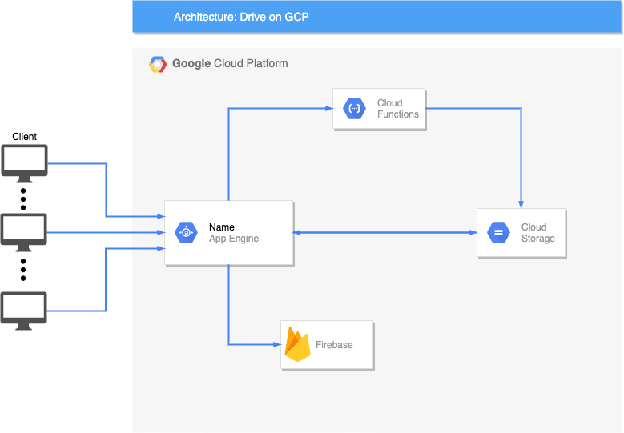
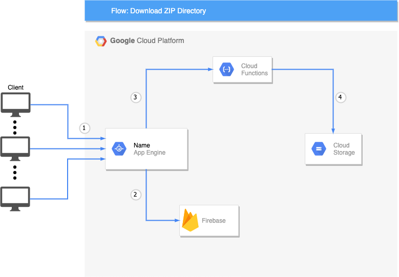
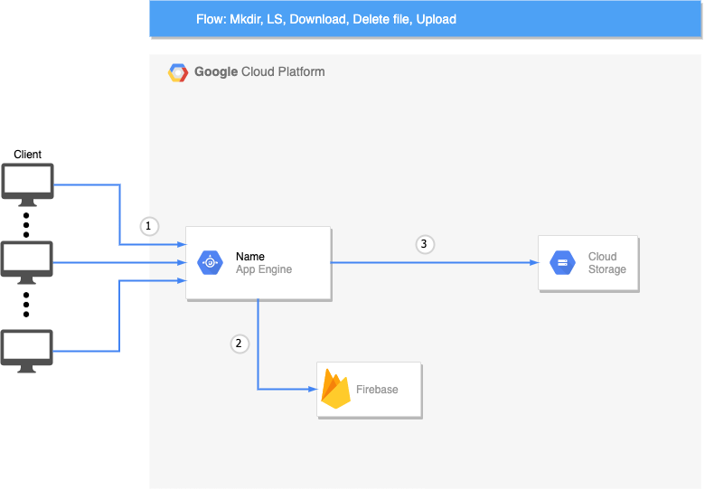

# Drive-on-Google-Cloud-Platform

A complete drive system built on Google Cloud platform with Spring using AppEngine, Firebase auth, Cloud functions, Cloud Storage.

This repository is a sort of code base for the use of Spring Framework in a serveless way with the aid of other google cloud services. 
Feel free to reuse our code but remember to cite us in your works.

We provide a [video](https://www.youtube.com/watch?v=6Uht4Emzqic) link to see all functionality of the drive.

## Architecture
The project provide the following functionalities: 
1)  Firebase Authentication Login/Logout
2)  Listening folder
3)  Mkdir 
4)  Delete dir and content 
5)  Delete file 
6)  Upload file 
7)  Download directory (using zip format using Cloud Function)

The architecture is shown in this figure:

The Download of the zip flow is shown in the figure:

The other functionalities follow the same flow in figure:

## Compilation 
To compile the project 

1) Clone the repository
2) Install all maven dependencies
3) Install the Google Cloud Platform SDK
4) Configure your Google Cloud Platform account with the GCP CLI and do the same for the Firebase API
5) You have to replace in code your authentication code otherwise you cannot access to the cloud services  
   5.1 Firebase Auth token in FirebaseLib constructor in the line .setDatabaseUrl("XXX") 
   5.2 FileController abstract class init change the byte array with your GCP configuration file. 

### Documentation
We provide a documentation (pdf file in the repository root) but it's avaiable in Italian 🇮🇹 language.

We found very hard working with documentation with the huge ammount of  API version, a common problem is that find the right maven repository version for the example in documentation.

# Authors

* **Andrea Bacciu**  - [github](https://github.com/andreabac3)
* **Valerio Neri**  - [github](https://github.com/andreabac3)
